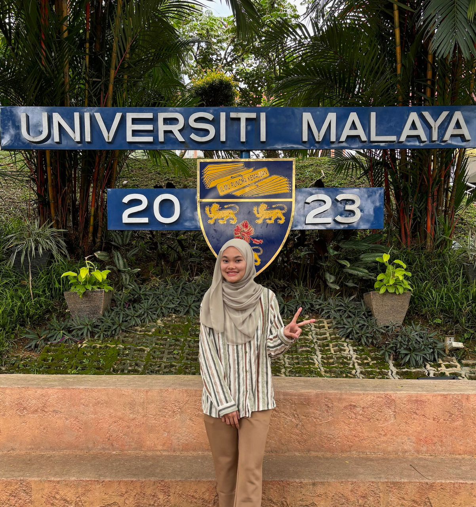

# 👋 Introduction

Hi there! I’m **Illya Nabila**, a curious and creative Software Engineering student currently exploring the world of **Software Maintenance and Evolution** 🚀

I’m fascinated by how software grows, changes, and adapts over time — kind of like living organisms that need care and updates to stay healthy 🧩. Through this course, I hope to sharpen my understanding of **modern maintenance strategies**, **legacy system handling**, and how to **keep software sustainable and reliable** for years to come.

---

## 🌱 A Bit More About Me

* 💻 Passionate about full-stack development, especially using **Next.js**, **Express**, and **MongoDB**
* 🤖 Interested in **AI-driven systems**, recommender systems, and green technology 🌿
* 🧠 I enjoy debugging (most of the time) — it feels like detective work for code!
* ✨ Currently working on several projects including **B2B Recommender System** and **E-invoice platform**
* ☕ I run on a steady supply of caffeine and lo-fi beats 🎧

---

## 📸 That’s Me!

[

> Always ready to learn something new — one commit at a time 💡

---

## 🌐 GitHub Profile

Check out my personal projects and repositories 👉 [**@IllyaNabila**](https://github.com/IllyaNabila)

---

## 🎯 Fun Fact

I believe every old piece of code has a story — and maintaining it is like time-traveling through someone else’s logic ✨
